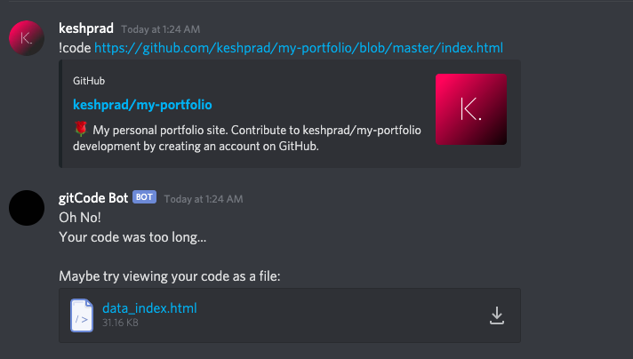

# gitCode-bot
Click [here]( https://discord.com/oauth2/authorize?client_id=759050188382797875&scope=bot ) to invite gitCode Bot to your server!  
## About  
A discord bot that gets the code file from any public repo on GitHub.  

For shorter code sections, the code is displayed as a codeblock in the channel.

  

However, Discord has a 2000 character cap on message lengths, so longer files are sent as a downloadable file.

## Development
When developing, make sure to add the Discord Bot token on the last line of `bot.py`. Replace {os.environ['TOKEN']} with the token